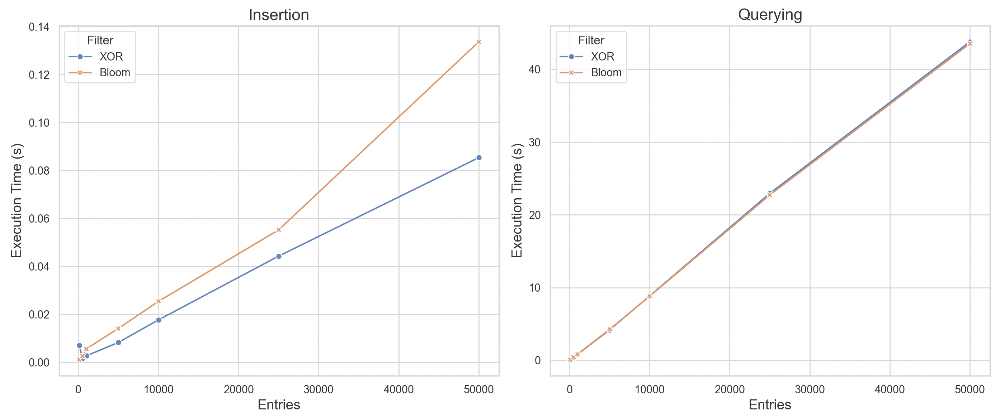

# xor-redis

Implementation of an [Xor filter](https://arxiv.org/pdf/1912.08258.pdf) (a probabilistic data structure which is faster/more memory efficient than Bloom/Cuckoo filters) for use in Redis instances.

### Quick Start

1. Run using Docker with `docker pull tfsingh/xor-redis:0.1.0 && docker run -d -p 6379:6379 tfsingh/xor-redis:0.1.0`

### API

**`XOR.POPULATE`**

Initializes an XOR filter with a set of entries. Overwrites existing data under the same key.

Args

- **Key:** Identifier for the filter.
- **Entries:** List of objects to include.

**`XOR.CONTAINS`**

Checks for an entry's presence in the filter. Like Bloom filters, may return false positives but no false negatives.

Args

- **Key:** Identifier for the filter.
- **Entry:** Object to check.

### Benchmarks

Most code used in benchmarking/testing is available in the [evals](https://github.com/tfsingh/xor-redis/tree/main/evals) directory (memory profiling was done through redis-cli).

| Filter Type  | `used_memory_peak` | `used_memory_peak_human` |
| ------------ | ------------------ | ------------------------ |
| Xor Filter   | 6,112,496          | 5.83M                    |
| Bloom Filter | 6,844,056          | 6.53M                    |

### Acknowledgements

Thank you to Thomas Graf and Daniel Lemire for discovering Xor filters, and for their [Go implementation](https://github.com/FastFilter/xorfilter/blob/master/xorfilter.go) which was used as a reference.
